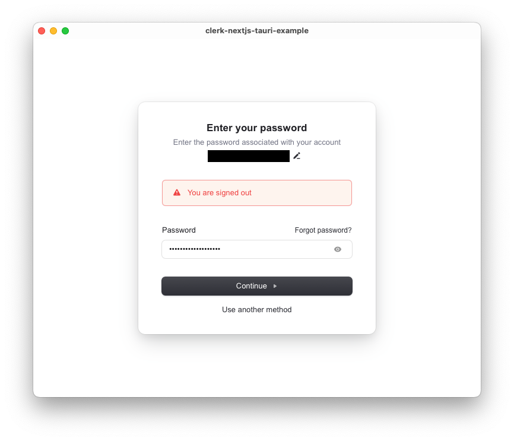

# clerk-nextjs-tauri-example

## Getting Started

Create a `.env.local` file in the root of the project and add the following:

```
NEXT_PUBLIC_CLERK_PUBLISHABLE_KEY=pk_test_************
```

Then run

```
pnpm install
pnpm tauri dev
```

This should work, you should be able to login, etc.

## Recreating the error

Modify the `.env.local` file by using your production publishable key:

```
NEXT_PUBLIC_CLERK_PUBLISHABLE_KEY=pk_live_************
```

Then run

```
pnpm install
pnpm tauri build
```

Then, if you start the app that is produced at `/src-tauri/target/release/bundle/macos/clerk-nextjs-tauri-example.app`, when attempting to login, you should get the following error:


